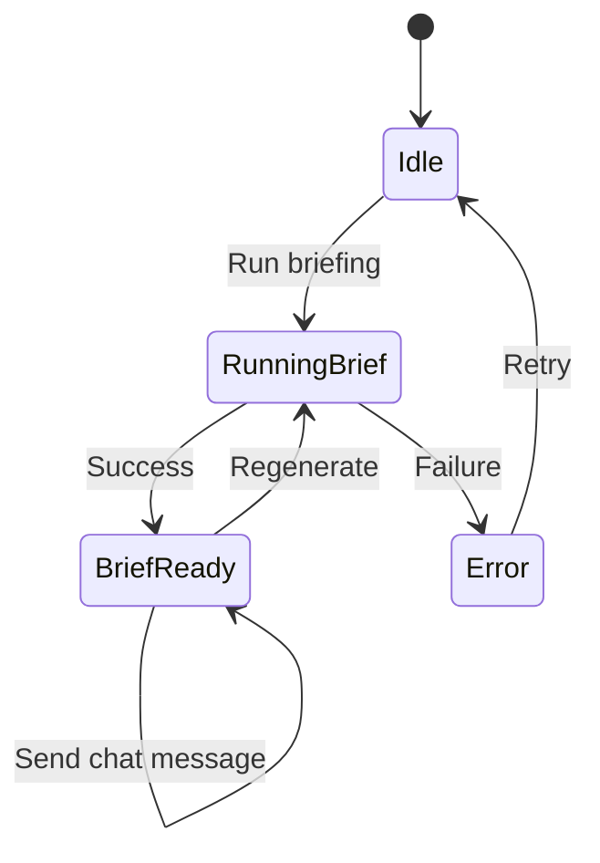
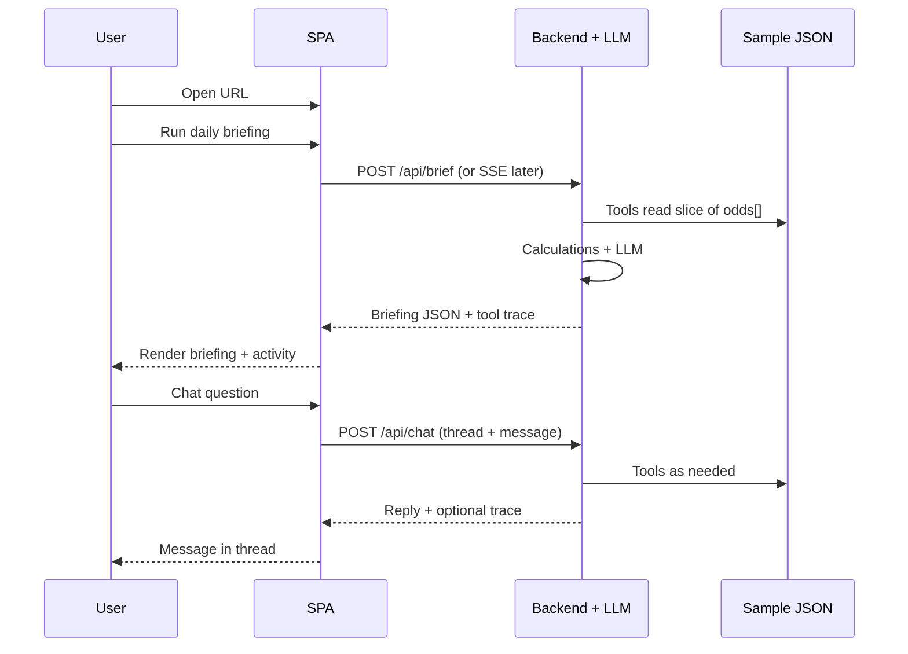

# App wireframes — Odds Agent (sample data)

Low-fidelity layout and flows for a **single-page** experience: generate a briefing from the sample dataset, show **reasoning** (tools / sources), then **chat** grounded in the same data. UI polish is intentionally minimal per the brief.

**Dataset:** `data/sample_odds_data.json` (optional Postgres mirror via `run_readonly_sql` when `DATABASE_URL` is set)

---

## 1. Data the UI (and tools) sit on

Each element of `odds[]` is one **game × sportsbook** row:

| Field | Role in UI |
|--------|------------|
| `game_id`, `home_team`, `away_team`, `commence_time` | Group rows into a **game**; headings and filters |
| `sportsbook` | Book column, quality ranking, “which book” answers |
| `markets.spread` | `home_line`, `away_line`, `home_odds`, `away_odds` |
| `markets.moneyline` | `home_odds`, `away_odds` |
| `markets.total` | `line`, `over_odds`, `under_odds` |
| `last_updated` | Staleness / anomaly callouts |

**Derived units (not in JSON, computed via tools):** implied probability per side, vig, no-vig fair %, best line across the 8 books, flags (stale, outlier, arb hints).

---

## 2. Page regions (desktop-first, one column on mobile)

```
┌──────────────────────────────────────────────────────────────────────┐
│  Odds Agent                                    [ Run daily briefing ] │
├──────────────────────────────────────────────────────────────────────┤
│  BRIEFING (structured output)                                          │
│  ├─ Market overview (10 games, slate summary)                          │
│  ├─ Flagged anomalies (stale / outlier — link → game_id + book)        │
│  ├─ Top value (best prices + short math: implied %, vig mention)       │
│  └─ Sportsbook quality (ranked list + 1-line rationale each)           │
├──────────────────────────────────────────────────────────────────────┤
│  AGENT ACTIVITY (collapsible)                                          │
│  • tool: list_games / get_game_odds / compute_market_summary …         │
│  • source: sample_odds_data.json                                       │
├──────────────────────────────────────────────────────────────────────┤
│  FOLLOW-UP CHAT                                                         │
│  ┌────────────────────────────────────────────────────────────────┐  │
│  │ User: Why flag Knicks game?                                     │  │
│  │ Agent: Grounded reply citing books + last_updated + prices…      │  │
│  └────────────────────────────────────────────────────────────────┘  │
│  [ Type a message… ]                                    [ Send ]       │
└──────────────────────────────────────────────────────────────────────┘
```

- **Run daily briefing:** primary CTA; disabled or shows spinner while the agent runs.
- **Briefing:** render from structured JSON (or markdown sections) the model returns — not a wall of raw tool JSON for the analyst.
- **Agent activity:** satisfies “some indication of reasoning”; default **expanded** during run, **collapsed** after success optional.
- **Chat:** same session/thread id; context = briefing + tool results or server-held state (not re-uploading full 80 rows to the client each time if avoidable).

---

## 3. States



| State | Briefing panel | Activity panel | Chat |
|--------|----------------|----------------|------|
| Idle | Empty or last run (stale badge optional) | Idle | Enabled if prior briefing exists, else placeholder |
| Running | Skeleton / “Generating…” | Live tool lines | Disabled or queued |
| Ready | Full sections | Collapsible trace | Enabled |
| Error | Error message + retry | Last failed step if any | As before |

---

## 4. Flow (end user)



---

## 5. Optional compact row (future “data inspector”)

Not required for the take-home; useful for debugging and demos.

```
Game: Lakers @ Celtics  |  Book: DraftKings  |  ML H/A -228 / +196  |  Updated: …
```

Keep it **secondary** (tab or drawer) so the main story stays briefing + chat + reasoning.

---

## 6. Implementation notes (for build phase)

- **File path:** canonical dataset is `data/sample_odds_data.json` (loaded by `services/odds_repository.py`).
- **Grounding:** chat answers should prefer **tool-backed** facts (game_id, sportsbook, numeric odds) over free recall.
- **Out of scope:** model should say so when the question needs data not in the 80 rows (aligns with `agents.md`).
